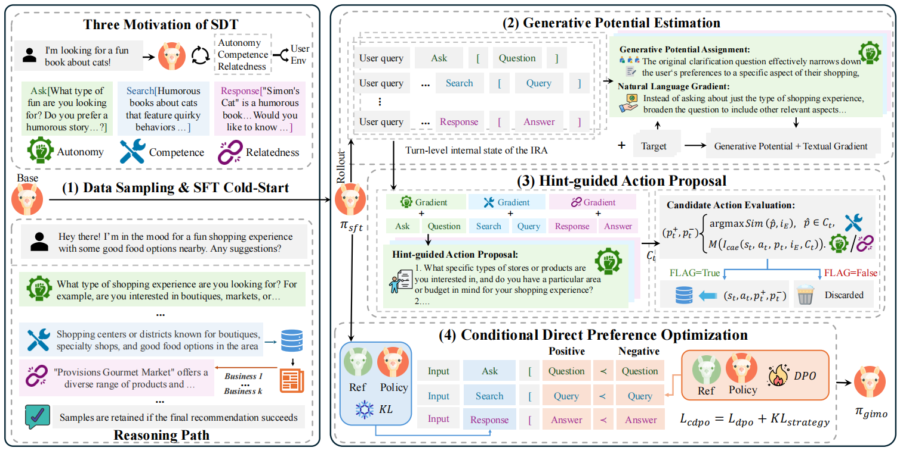

# Optimizing Multi-Turn Interactive Recommendation Agents via Generative Intrinsic Motivation (WWW26)



## Usage
### Getting Start
You can use following scripts to install related python package through pip:
```
git clone https://github.com/XueyangFeng/GIMO.git
cd GIMO
pip install -r requirements.txt
```


### **AILO Environment Setup**

Following ECPO, We provide a detailed pipeline for the AILO environment, including additional [README files](./user_simulator/readme.md). For a quick setup, follow these steps:

1. Download the [index file](https://drive.google.com/file/d/1P6QkUrikHnwxNov0fUY3SxWQkl1qve0O/view?usp=drive_link).
2. Unzip the downloaded file into the `user_simulator/embedding/` folder.

### **API Configuration**
All LLM (Large Language Model) calls in this repository are made using OpenAI-like interfaces. To configure the APIs:

1. Set your API information in the `config/api_config.json` file.
2. For closed-source models, set the information directly in the config.
3. For open-source models, use `vllm` for local deployment. We have provided an example script in the `model/` directory.


## **Running GIMO**

To run the existing prompt-based Conversational Recommendation Agent (IRA) or an aligned IRA, you can set the relevant configuration in the `main.sh` file and execute it.

Our IRA alignment process consists of four main stages:
1. **SFT (Stage 1)**: Supervised Fine-Tuning & Cold Start
2. **GIMO (Stages 2-4)**: Generative Intrinsic Motivation based Optimization

### SFT & Cold Start
```
cd LLaMA-Factory
# Step 1: Configure the dataset path in data/dataset_info.json
# Step 2: Run the SFT training script
bash gimo/{dataset}/sft/sft.sh
```

### Generative Potential Estimation
```
# rollout use sft policy
cd GPE_HAP
python rewrite_v3.py --domain {dataset} 
```

### Hint-conditioned Action Proposal


### Conditional Direct Preference Optimization

We have **seamlessly integrated** CDPO into the **LLaMA-Factory** training framework.  
No additional setup is required.

The core implementation can be found at:
```
LLaMA-Factory/src/llamafactory/train/dpo/train.py
```
The key implementation extends standard DPO loss with an action-level KL regularization term to achieve conditional alignment:

```python
def adpo_loss(
    self,
    chosen_logps: torch.FloatTensor,
    rejected_logps: torch.FloatTensor,
    ref_chosen_logps: torch.FloatTensor,
    ref_rejected_logps: torch.FloatTensor,
    action_policy_logps: torch.FloatTensor,     # [B, T, V]
    action_reference_logps: torch.FloatTensor,  # [B, T, V]
    action_mask: torch.BoolTensor,              # [B, T, 1]
    kl_type: str = "l2",
    kl_coef: float = 1.0,
) -> Tuple[torch.FloatTensor, torch.FloatTensor, torch.FloatTensor]:

    # === Step 1: Standard DPO loss ===
    dpo_losses, dpo_chosen_rewards, dpo_rejected_rewards = self.dpo_loss(
        chosen_logps,
        rejected_logps,
        ref_chosen_logps,
        ref_rejected_logps
    )

    # === Step 2: Action-level KL regularization (masked) ===
    if kl_type == "l2":
        diff = (action_policy_logps - action_reference_logps) ** 2
    elif kl_type == "abs":
        diff = torch.abs(action_policy_logps - action_reference_logps)
    else:
        raise ValueError(f"Unsupported kl_type: {kl_type}")

    # Masked KL only on valid action regions
    masked_diff = diff * action_mask  # [B, T, V]
    vocab_size = diff.size(-1)
    token_count = action_mask.sum(dim=(1, 2)).clamp(min=1)

    kl_reg = masked_diff.sum(dim=(1, 2)) / (token_count * vocab_size)

    # === Step 3: Weighted combination ===
    total_loss = dpo_losses + kl_coef * kl_reg

    return total_loss, dpo_chosen_rewards, dpo_rejected_rewards
```

A ready-to-run CDPO training script is provided in the LLaMA-Factory repository.

```
cd LLaMA-Factory
# Step 1: Configure the dataset path in data/dataset_info.json
# Step 2: Run the CDPO training script
bash gimo/{dataset}/gimo/adpo_v1_sample1.sh
```


### Evaluation

Test recommendation metric using simulator environment:
```
# test the existing prompt-based IRA baseline
bash main.sh
# test the trained IRA
bash main_lora.sh
```

### DriftAware-GIMO: Structured Memory under Interest Drift

We add an optional structured memory extension for studying preference drift in
multi-turn recommendation. The memory explicitly separates positive
preferences, negative preferences, hard constraints, and soft preferences, each
with confidence and turn metadata. It supports retain, merge, overwrite, and
forget operations so experiments can measure when an agent preserves useful
history versus follows stale preferences.

The default simulator behavior is unchanged. To enable the new memory state in
the user simulator, instantiate `UserAgentEnv` with `memory_mode="structured"`.

```
env = UserAgentEnv(
    persona_path="user_simulator/task/Yelp_test.jsonl",
    user_id=0,
    item_id=0,
    config_path="config/api_config.json",
    format_path="config",
    domain="restaurant",
    model_type="openai",
    memory_mode="structured",
)
```

Run the lightweight offline drift benchmark without an API key:

```
python -m user_simulator.evaluation.drift_memory_eval
```

This benchmark compares Full History, Summary Memory, Retrieval Memory, and
Structured Memory using Recovery Turns, Stale Preference Violation Rate,
Constraint Satisfaction Rate, Success@K, and Token Cost. See
[`docs/driftaware_gimo.md`](docs/driftaware_gimo.md) for the full protocol.

### CritiqueScope-GIMO: Scope-Aware Feedback Interventions

We also add a stronger research extension: natural-language feedback is treated
as an exposure-conditioned critique rather than a durable preference label by
default. For example, "too much UFC lately" should temporarily attenuate UFC
recommendations, while "never recommend political content" should become a
persistent filter.

`CritiqueScopeMemory` maintains two channels:

- Fast Memory: temporary critique interventions, fatigue, session context, and
  slate-level diversity requests.
- Slow Memory: durable constraints and preferences promoted only after explicit
  persistent language or repeated supporting evidence.

Enable it with `memory_mode="critiquescope"`:

```
env = UserAgentEnv(
    persona_path="user_simulator/task/Yelp_test.jsonl",
    user_id=0,
    item_id=0,
    config_path="config/api_config.json",
    format_path="config",
    domain="restaurant",
    model_type="openai",
    memory_mode="critiquescope",
)
```

Run the diagnostic benchmark:

```
python -B -m user_simulator.evaluation.critique_scope_eval
```

Build counterfactual preference pairs for CDPO/DPO-style alignment:

```
python -B -m user_simulator.evaluation.critique_uplift_pairs --output critique_pairs.jsonl
```

The benchmark reports Instruction Uplift, Over-Application Regret,
Over-Correction Regret, Memory Contamination Rate, and Token Cost. See
[`docs/critiquescope_gimo.md`](docs/critiquescope_gimo.md) for the schema and
experimental protocol.

### CritiqueWorld: Closed-Loop Scope-Aware Recommendation Testbed

The latest extension adds `CritiqueWorld`, a CPU-only, API-free closed-loop
testbed for evaluating whether critique memory actually changes recommendation
slates over time. Unlike the earlier memory-level diagnostics, CritiqueWorld
generates a slate each turn, simulates user behavior from a transparent latent
state, applies memory updates, reranks future items, and exports controlled
counterfactual branch rollouts.

Run the oracle closed-loop benchmark:

```
python -B -m user_simulator.evaluation.run_closed_loop_benchmark \
  --modes none flat structured time_decay critiquescope \
  --scenarios all \
  --seeds 0 1 2 3 4 \
  --max-turns 12 \
  --top-k 5 \
  --parser-mode oracle \
  --output-dir outputs/closed_loop_oracle
```

Run the deterministic-parser variant:

```
python -B -m user_simulator.evaluation.run_closed_loop_benchmark \
  --modes none flat structured time_decay critiquescope \
  --scenarios all \
  --seeds 0 1 2 \
  --max-turns 12 \
  --top-k 5 \
  --parser-mode deterministic \
  --output-dir outputs/closed_loop_deterministic
```

Outputs include trajectory JSONL, branch rollout JSONL, raw DPO-style
preference pairs, a lightweight `cdpo_pairs.jsonl` bridge for later
LLaMA-Factory/GIMO formatting, `cdpo_validation.json`,
`cdpo_dataset_manifest.json`, `llamafactory_dataset_info_snippet.json`,
materialized `cdpo_train.jsonl` / `cdpo_dev.jsonl` splits, summary CSV/JSON,
method-level aggregates, `closed_loop_report.md`, and a LaTeX table.
The branch metrics should be described as a controlled
counterfactual rollout proxy, not as complete causal inference. See
[`docs/critique_world.md`](docs/critique_world.md).


## References
1. Our evaluation method is based on [XueyangFeng/ECPO](https://github.com/XueyangFeng/ECPO).
2. Our training code is based on [hiyouga/LLaMA-Factory](https://github.com/hiyouga/LLaMA-Factory).
